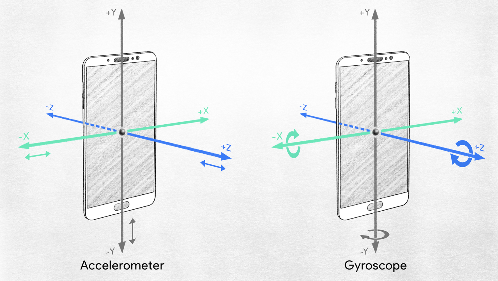
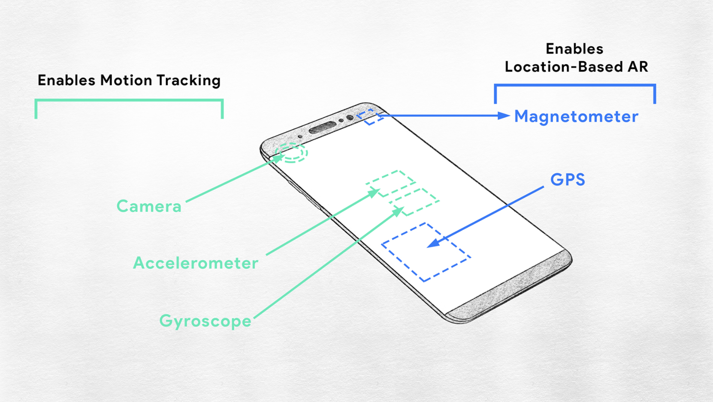

# Realidad aumentada

Qué es la *Realidad aumentada*? La realidad aumentada viene en el colectivo tecnologico desde los años 90. LA realidad aumentada nos permite 
integrar una capa de información digital en el mundo real.
Empresas como IKEA ya utilizan realidad aumentada para simular como sus muebles encajan en las habitaciones de los compradores.

>The term “Augmented Reality” was coined by two Boeing researchers in 1992

## El hardware que hace posible AR
### Seguimiento de movimiento para AR

  

- Acelerometro: Mide la velocidad con la que el dispositivo se mueve en los diferentes ejes (x, y, z)
- Giroscopio: Mide la velocidad angular en los diferentes ejes (x, y, z). Es útil para medir la rotación del celular y mantener la experiencia de AR.
- Cámara del celular: con AR, la cámara del teléfono proporciona una transmisión en vivo del mundo real circundante sobre el que se superpone el contenido de AR.

### Localización para AR

  

- Magnetometro: Provee al *smartphone* la posibilidad de determinar el norte magnetico de la tierra. Este dispositivo es clave en la AR por localización.
- GPS: El sistema de posicionamiento global que provee al *smartphone* su posición y tiempo.

### Vista del mundo real con AR

- Pantalla: Es a travéz de la pantalla que se renderizan y despliegan la información/imagenes para el usuario.

## Reglas básicas de comportamiento 
Los desarrolladores de AR deben conocer comportamientos claves para mezclar de una manera correcta el mundo real con el mundo digital.
1. *Placing*: *Placing* significa el lugar donde el objeto esta posicionado. No importa si la cámara se mueve, el objeto debe mantenerse en el mismo lugar.
2. *Scale*: Cuando nos acercamos o alejamos del objeto simulado, este debe crecer o disminuir para otorgar una mayor realidad a AR.
3. *Occlusion*: Corresponde cuando un objeto "tapa" otro objeto simulado. Es necesario renderizar el objeto tapado, para así mejorar la experiencia de AR. **Este es uno de los comportamientos más complicados de simular**
4. *Lighting*: Colores, sombreados y sombras deben modificarse para otorgar una mejor experiencia de AR.
5. *Solid*: Los elementos deben parecer sólidos en AR. 
6. *Context Awareness*: **Es el más díficil de lograr**. Entender el contexto, para cualquier contexto!

## La mágica de AR: detectar, sensar y medir
* *Outside-In Tracking*: Las cámaras estan situados no el el celular, si no en el espacio, tipicamente en paredes. Este metodo ofrece más precición en el "trackeo", pero al agregar dispositivos externos pierde portabilidad.
* *Inside-Out Tracking*: Usa cámaras y sensores situados en el dispositivo para trackear la posición en el mundo real. Este metodo requiere más hardware en el dispositivo, pero ofrece más portabilidad.

