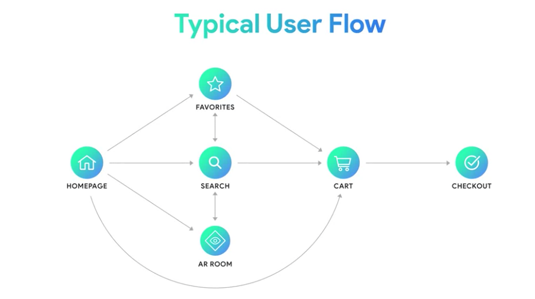

# ARCore
ARCore es la API de Google para realidad aumentada. ARCore integra contenido virtual con el mundo real gracias a tecnología como *Motion tracking*, *envioremental understanding* y *ligth estimation*
## Dentro de ARCore
### *Motion tracking* 
Las plataformas de [[ar.md]] necesitan saber cuando el usuario se mueve. La tecnología detras de esto se denomina **SLAM**, **S**imultanueous **L**ocalization **A**nd **M**apping. Este es el proceso mediante el cual robot y smartphones analizan, entienden y se orientas a si mismo en el mundo físico. **SLAM** requiere hardware, como camaras, sensores, giroscopios y acelerometros.
 ARCore utiliza un proceso llamado **COM**, **C**oncurrent **O**dometry and **Mapping**, **COM**, le dice al smartphone donde esta ubicado en relación a su ubicación en el espacio 

### Entendiendo el entorno
 El proceso parte con *feature points*, que son iguales a los usados para Motion tracking.

## Limitaciones de ARCore
- Aproximadamente el 85% de los celulares en el mundo corren Android.
- A principios de 2018, ARCore era capaz de funcionar en 100 millones de dispositivos Android. ARCore requiere mucho procesamiento y no todos los modelos que corren Android tienen
las especificaciones requeridas.
- Al igual que nuestros ojos **ARCore** necesita luz para ver. Para encontrar esos *feature points* y planos la cámara del celular necesita obtener una buena foto del entorno
Unas malas condiciones de luz, es un problema para **TODAS** las soluciones de AR al día de hoy.

## Pensar como usuario
Una buena práctica al momento de partir una aplicación de AR, es mapear el flujo del usuario.

  

## Términos 
- Unvany Valley: Cuando un caracter digital aparace casi como un humano real, causando un sentimiento de que no encaja de alguna forma

[//begin]: # "Autogenerated link references for markdown compatibility"
[ar.md]: ar "Realidad aumentada"
[//end]: # "Autogenerated link references"