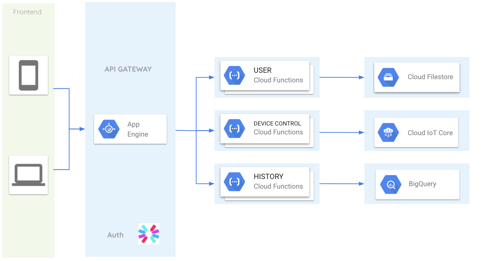

# Cloud iOLED

## Documentación de la nube de iOLED
La principal tarea de la nube de iOLED es la administración y control de los dispositivos antü conectados a Internet.

Las principales funciones que la nube ACTUALMENTE cumple son:

* Control de manejo de usuarios
* Control de dispositivos
* Guarda los datos en una base de datos
* Despliegue historico de los datos

Toda la información actualmente se encuentra desplegada en [[google-cloud]] sin embargo es posible realizar la migración a otra plataforma en la nube.

## Arquitectura de la nube iOLED

ACTUALMENTE la nube de iOLED funciona con una arquitectura de microservicios. Se esta trabajando a una migración a un servicio monolitico ya que es más facil el desarrollo en equipos chicos.

[[ioled]]
[[CTO]]

[//begin]: # "Autogenerated link references for markdown compatibility"
[google-cloud]: google-cloud "Google Cloud"
[ioled]: ioled "iOLED"
[CTO]: CTO "CTO"
[//end]: # "Autogenerated link references"