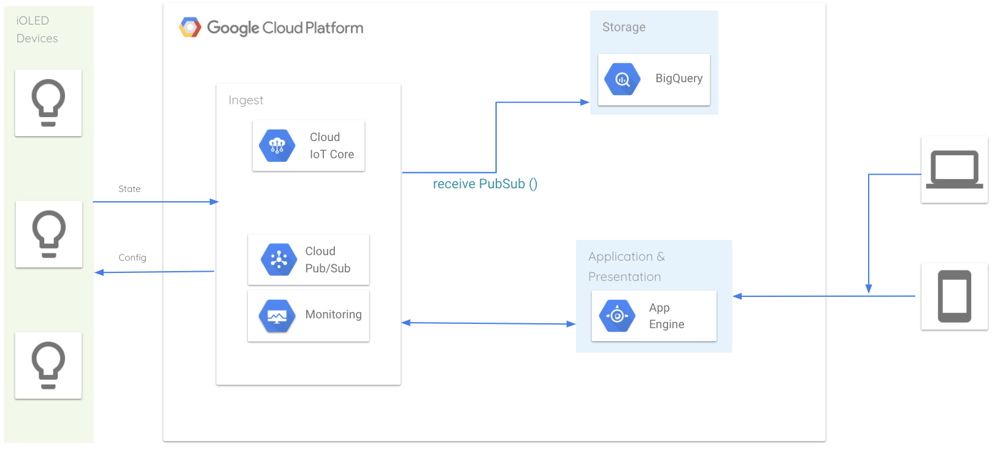

# IoT Core

Con Cloud IoT Core, puede controlar un dispositivo enviándole una configuración de dispositivo. La configuración de un dispositivo es un blob de datos arbitrario definido por el usuario enviado desde Cloud IoT Core a un dispositivo. Los datos pueden ser estructurados o no estructurados. 

La información del estado del dispositivo captura el estado actual del dispositivo, no el entorno. Los dispositivos pueden describir su estado con un conjunto arbitrario de datos definidos por el usuario enviados desde el dispositivo a la nube. Los datos pueden ser estructurados o no estructurados. 

### Configuración del dispositivo
```json
"config": {
			"duty": 0.5,
 			"state": true,
 			"timerOn": "18:30",
 			"timerOff": "18:29",
 			"timerState": true ,
			"timerDuty": 1,
			"rampState": true,
			"onTime": 1,
			"offTime": 0
		}
```

### Estado del dispositivo
```json
{  
  "hum":30.548615,
  "temp":34.038687
}
```

Promediar la humedad, y obtener el valor correcto son promedio +- desviación estandar.



[[iot]]


[//begin]: # "Autogenerated link references for markdown compatibility"
[iot]: iot "IoT"
[//end]: # "Autogenerated link references"